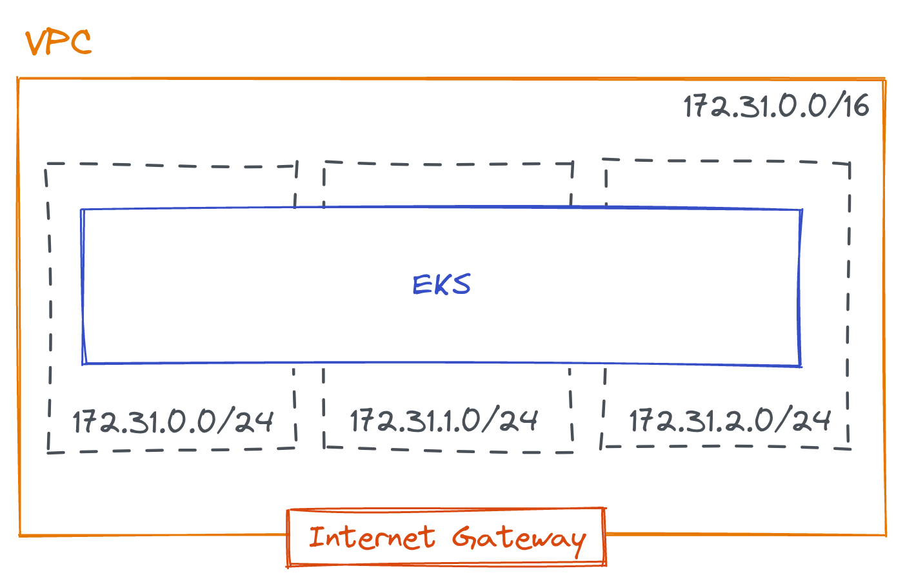

# httpbin-on-k8s

Déploiement d'une API `httpbin` scalable sur Kubernetes en utilisant le service managé Kapsule sur Scaleway.

## Architecture du projet

Ce projet utilise :
- Terraform (et Terragrunt) pour provisionner les ressources d'infrastructure.
- Ansible pour la configuration de base du cluster Kubernetes (installation d'ArgoCD et secrets).
- ArgoCD pour le déploiement des composants dans le cluster avec des charts Helm.


Il est actuellement déployé sur :
- https://env1.wttj.pauldn.xyz
- https://env2.wttj.pauldn.xyz

Ce projet se veut scalable :
- Le node pool est capable de scaler en cas de fort trafic.
- Les pods applicatifs `httpbin` scalent en cas de forte charge avec un HorizontalPodAutoscaler.

Il est possible de tester avec ApacheBench, par exemple (5000 requêtes, jusqu'à 20 requêtes concurrentes) :

```
$ ab -n 5000 -c 20 https://env1.wttj.pauldn.xyz/uuid
...
Concurrency Level:      20
Time taken for tests:   78.171 seconds
Complete requests:      5000
Failed requests:        0
Total transferred:      1580000 bytes
HTML transferred:       265000 bytes
Requests per second:    63.96 [#/sec] (mean)
Time per request:       312.683 [ms] (mean)
Time per request:       15.634 [ms] (mean, across all concurrent requests)
Transfer rate:          19.74 [Kbytes/sec] received

Percentage of the requests served within a certain time (ms)
  50%    282
  66%    290
  75%    298
  80%    307
  90%    394
  95%    487
  98%    659
  99%    871
 100%   1493 (longest request)
```

Les pistes pour passer à un niveau supérieur :
- Passer sur un tier de LB plus élevé sur Scaleway.
- Ajouter du monitoring pour voir les bottlenecks (Nginx, pod applicatif) et mieux gérer la consommation de ressources.
- Vérifier les modèles d'instance utilisés.

## Déployer le projet

### Provisioning de l'infrastructure

Le provisioning se fait via Terraform avec Terragrunt avec un backend pour les tfstates sur S3, il faut donc créer
un bucket S3 (sur Scaleway ou sur AWS) et configurer ses accès avec le CLI `aws` au préalable.

Après avoir mis à jour les informations (nom, profil du CLI, bucket S3) dans `terragrunt/environments/scw-dev/terragrunt.hcl`
(ou `terragrunt/environments/aws-dev/terragrunt.hcl`) :

```
$ cd terragrunt/environments/scw-dev
$ terragrunt run-all apply
```

### Configuration d'ArgoCD

La configuration se fait via Ansible. Si besoin, créer un environnement Python pour installer les dépendances.

```
$ virtualenv ./venv -p python3.8
$ source venv/bin/activate
$ pip install -r requirements.txt
```

Puis lancer le playbook de setup (nécessite la clé du Vault Ansible dans un fichier `ansible/ansible_vault_file`).

```
$ cd ansible
$ ansible-playbook -i inventories/scw-dev kubernetes-setup.yml
```

Le playbook installera ArgoCD et créera une applications `apps-all` qui déploiera tout ce qui se trouve dans `environments/scw-dev`.

### Déploiement de nouvelles ressources

Le déploiement se fait en continu dans une logique GitOps où les charts Helm déclarés sont déployés par ArgoCD qui
est en synchronisation automatique.

Ce qui est déployé actuellement :
- `apps-infra` : les composants d'infrastructure
  - `argocd` : configuration d'ArgoCD
  - `ingress-nginx` : ingress controller avec Nginx
  - `cert-manager` : gestion des certificats TLS
- `env` : les applicatifs (dans ce cas là, `httpbin`)

On peut déployer autant d'environnements que souhaité, actuellement deux environnements sont déployés

## Architecture cloud

Ce projet utilise [Scaleway](console.scaleway.com/) pour déployer les ressources cloud nécessaires :
- Cluster Kubernetes (avec Kapsule)
- Load-balancer (via l'intégration avec le service Kapsule)
- Ressources DNS

Le service Kapsule n'étant pas encore intégré au VPC Scaleway (les nodes sont publics, le déploiement de 
l'infrastructure est aussi possible sur AWS avec EKS si on souhaite avoir la main sur le réseau.

### Architecture Scaleway

Le cluster Kapsule est mono-AZ, avec un node pool sur lequel l'autoscaling est activé.


### Architecture AWS [WIP]

Le cluster EKS est multi-AZ, avec un autoscaling group.



Reste à configurer (par manque de temps et d'habitude !) :
- Spécifier un launch template pour l'autoscaling group (on utilise les paramètres par défaut pour le moment)
- Configurer un network load balancer (ou installer le [controller](https://docs.aws.amazon.com/eks/latest/userguide/aws-load-balancer-controller.html) via un chart Helm)
- Configurer le DNS via Route53
